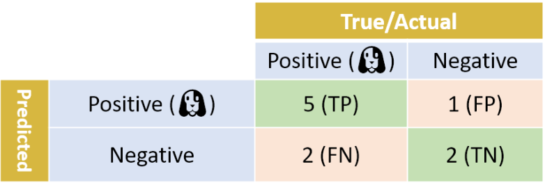
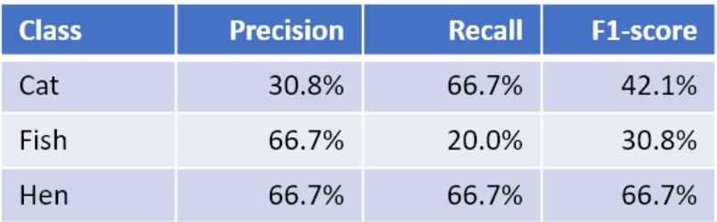

### 1. 이진 분류(binary classification)일 경우

일반적으로 precision와 recall 점수가 높은 것을 선호한다. 그러나 튜닝할 때 precision을 높이면 recall 점수가 낮아지거나 그 반대 현상이 나타날 수 있다. 이때 모델 성능을 단일 metric으로 요약해주는 것이 **F1-score**이다.

즉. precision와 recall을 하나의 숫자로 결합하는 방법이다.

**F1-score = 2 ( precision * recall ) / (precision + recall)**

F1- scoreㄴ = 2 × (83.3 % × 71.4 %) / (83.3 % + 71.4 %) = 76.9 %

### 2. 다중 분류(multi-class classification)일 경우

예를 들어) cat의 **F1-score**

**F1-score**(Cat) = 2 × (30.8% × 66.7%) / (30.8% + 66.7%) = 42.1%

`class별 F1-scores를 하나의 숫자로 결합하기`

#### 방법1) **macro-F1** ( macro-averaged F1-score)

> 클래스 별 F1 점수의 산술 평균

- **Macro-F1** = (42.1% + 30.8% + 66.7%) / 3 = 46.5%

​      (Macro-F1\*= 2 × (54.7% × 51.1%) / (54.7% + 51.1%) = 52.8%) => 위에 있는 것 사용을 권장함

- **Macro-precision** = (31% + 67% + 67%) / 3 = 54.7%

- **Macro-recall** = (67% + 20% + 67%) / 3 = 51.1%

  

#### 방법2) **weighted-F1** (weighted-average F1-score)

> 각 클래스의 F1- score에 해당 클래스의 **샘플 수**를 **가중**

- **Weighted-F1** = (**6** × 42.1% + **10** × 30.8% + **9** × 66.7%) / 25 = 46.4%

- **Weighted-precision** = (6 × 30.8% + 10 × 66.7% + 9 × 66.7%)/25 = 58.1%

- **Weighted-recall** = (6 × 66.7% + 10 × 20.0% + 9 × 66.7%) / 25 = 48.0%

#### 방법3) **micro-F1** (micro-averaged F1-score)

> 모든 샘플에 대해서 micro-averaged precision ,micro-averaged recall을 계산한 다음 이 둘을 결합한다.

confusion matrix을 다시 보면,

**precision** = TP / (TP+FP) = (4+2+6) / ( (4+2+6) + (6+3+1+0+1+2) ) = 48.0%

(FP의 총 수: 예측 오류의 총 수=>핑크 셀의 합산 )

**recall** = TP / (TP + FN) = (4+2+6) / ( (4+2+6) + (6+3+1+0+1+2) ) = 48.0%

(FN의 총 수: 예측 오류의 총 수=>핑크 셀의 합산 )

===> precision과 recall 값이 같다. 즉 다음과 같이 정의할 수 있다. 

- **micro-F1 = micro-precision = micro-recall**

- **micro-F1 = micro-precision = micro-recall = accuracy**

출처 : https://towardsdatascience.com/multi-class-metrics-made-simple-part-ii-the-f1-score-ebe8b2c2ca1