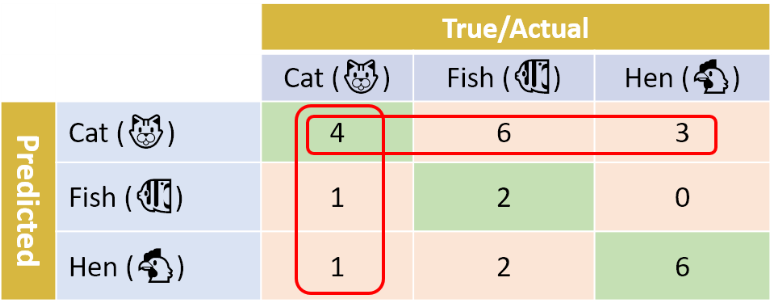

### 1. 이진 분류(binary classification)일 경우

- **precision**(정밀도) = TP/(TP+FP)
  - 5/(5+1) = 83.3%

- **recall** = TP/(TP+FN)
  - 5/(2+5) = 71.4%

- **accuracy** = (TP+TN)/(TP+TN+FP+FN)
  - (5+2)/(5+2+1+2) = 70.0% 

>  precision or recall 중에 어느 것이 더 중요할까?

==> 특정 분류 문제에 달려있다.

- 예1) 당뇨병 판별 

  - “Positive”  : 당뇨병이 있음을 의미 
  - “Negative”  : 환자가 건강하다는 것을 의미

  ==> 높은 recall을 원함

- 예2) 비디오 추천 시스템

  - “Positive”  : 관련 비디오
  - “Negative”  : 관련성이 없는 비디오

  ==> 높은 precision를 원함 

### 2. 다중 분류(multi-class classification)일 경우

cat의 **recall** =  4 / (4+1+1) = 66.7 % ==> 고양이 사진의 2/3를 고양이로 분류했음을 의미한다.

출처 : https://towardsdatascience.com/multi-class-metrics-made-simple-part-i-precision-and-recall-9250280bddc2